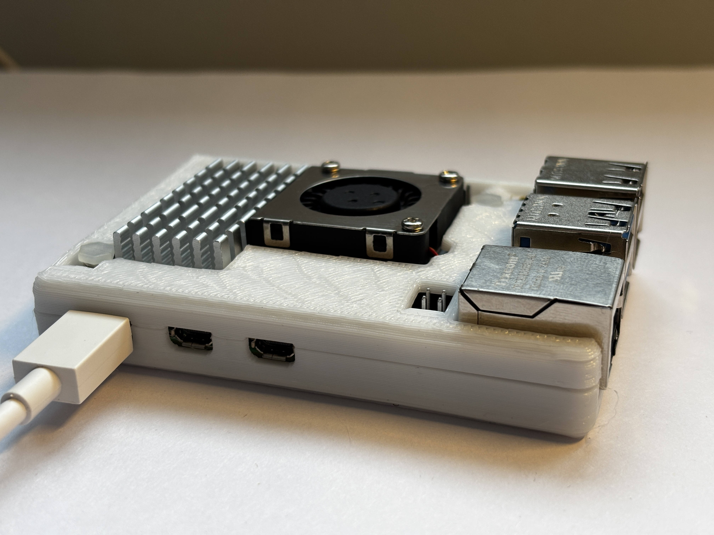

# malware-analys-vsosh

Project for VSOSH Olympiad. Checking for malware activity in files via Raspberry Pi 5 as a Sandbox platform. Full connection to Telegram.


## Installation

### Prerequisites

- Raspberry Pi 5 (or Linux system)
- Python 3.11+

### Setup

1. Clone the repository:
```bash
git clone https://github.com/Mandarin07/MIT-vsosh.git
cd MIT-vsosh

sudo apt install firejail   
sudo apt install tcpdump    
sudo apt install clamav     
sudo freshclam              
```

2. Create virtual environment:
```bash
python3 -m venv venv
source venv/bin/activate
pip install -r requirements.txt
```

3. Configure the project:
```bash
# Copy example configs
cp env.example .env
cp config.example.yaml config.yaml
cp allowed_users.example.json allowed_users.json

# Edit .env with your Telegram bot token
nano .env

# Edit allowed_users.json with your Telegram user IDs
nano allowed_users.json
```

4. MITRE ATT&CK:
```bash
mkdir -p mitre
curl -o mitre/enterprise-attack.json https://raw.githubusercontent.com/mitre/cti/master/enterprise-attack/enterprise-attack.json
```

5. Build tracer:
```bash
cd tracer_lib
make
cd ..
```

## Configuration

### .env
- `BOT_TOKEN` - Telegram bot token from @BotFather
- `VIRUSTOTAL_API_KEY` - (Optional) VirusTotal API key

### allowed_users.json
- `users` - List of Telegram user IDs allowed to use the bot
- `admin` - Admin user IDs
- `allowed_groups` - Allowed group chat IDs

### config.yaml
Analysis settings, scoring thresholds, ClamAV configuration.

## Starting the bot

```bash
source venv/bin/activate
python3 tgbot.py
```

## How it looks like?)




## License

This project is licensed under the [GNU General Public License v3.0](https://www.gnu.org/licenses/gpl-3.0.html).
